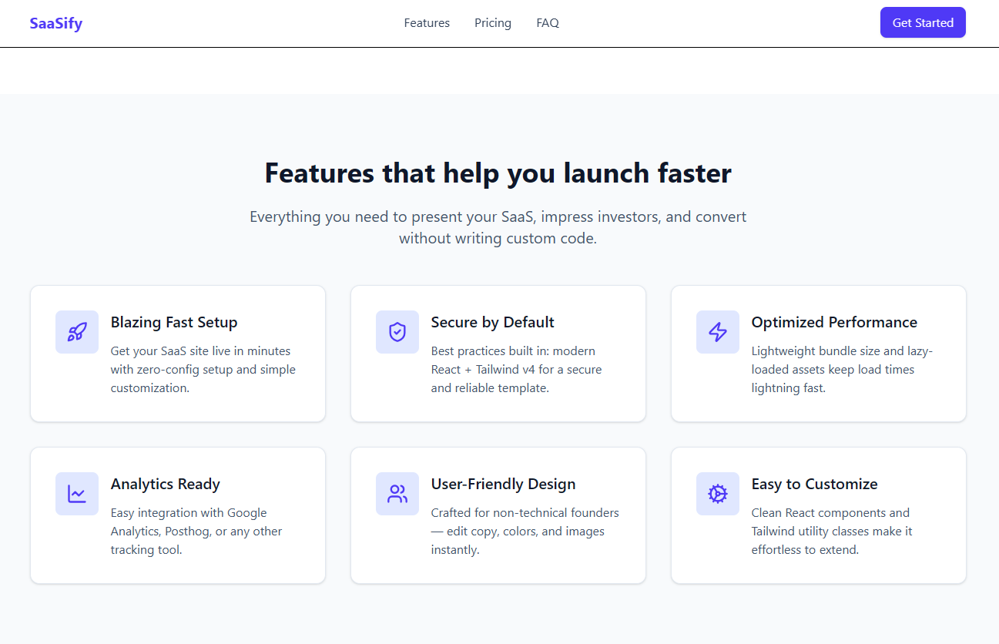
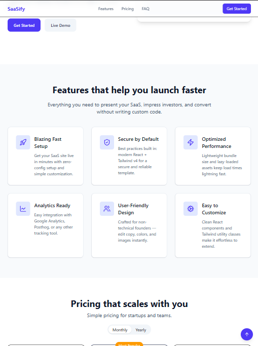
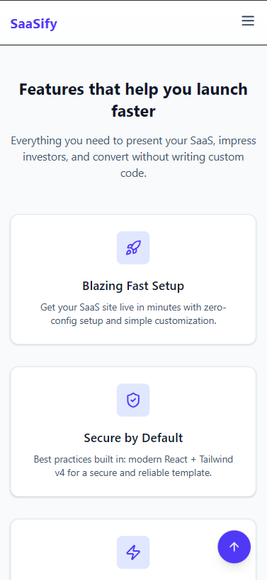

# SaaSify – React + Tailwind Landing Page Template

A modern, responsive landing page template built with **React** and **Tailwind CSS v4**. Perfect for startups, indie hackers, or SaaS products that want to launch fast without writing custom code.

## Demo




Demo link [Saasify Landing Page Template Live Demo](https://saasify-lp.netlify.app/)

---

## Features

* Fully responsive layout for **mobile, tablet, and desktop**
* **Hero section**, Features, Pricing, FAQ, and Footer components
* Animated **Back to Top** button
* Toggleable **pricing plans** (monthly/yearly)
* Accessible components with proper `aria-label`s
* Clean, modern design with **hover & active states**
* Built for quick customization

---

## Tech Stack

* **React** (Functional Components + Hooks)
* **Tailwind CSS v4**
* **Lucide Icons** for vector icons
* Optional: **Vite** or **Create React App** for bootstrapping

---

## Installation

1. **Clone the repo**

```bash
git clone https://github.com/yourusername/saasify-landing.git
cd saasify-landing
```

2. **Install dependencies**

```bash
npm install
# or
yarn install
```

3. **Start the development server**

```bash
npm start
# or
yarn start
```

4. Open your browser at `http://localhost:3000` (CRA) or the port provided by your dev server (Vite).

---

## Usage

* Replace text content in `src/components` for your product information.
* Replace placeholder images in `Hero.jsx` or other sections with your screenshots.
* Modify `features.js` and `pricing.js` in `src/data` to customize feature cards and pricing tiers.
* Tailwind utility classes make it easy to adjust **colors, spacing, typography, and layout**.

---

## Deployment

To build a production-ready version:

```bash
npm run build
# or
yarn build
```

Deploy the contents of the `build/` folder to your preferred hosting provider (Netlify, Vercel, GitHub Pages, etc.).

---

## Accessibility & SEO Notes

* All interactive elements include **`aria-label`** attributes
* Semantic HTML is used (`<nav>`, `<header>`, `<section>`, `<footer>`, `<button>`, etc.)
* SEO optimization (meta tags, structured data, alt attributes) should be handled by the user as per their content

---

## License

MIT License – feel free to use, modify, and distribute.